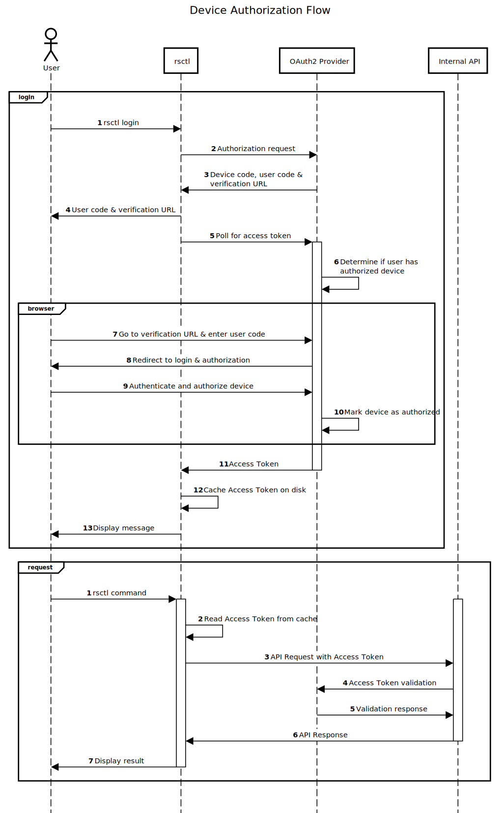

# OAuth2 Device Authorization Flow go module

This go module is a helper to implement [OAuth2 Device](https://www.rfc-editor.org/rfc/rfc8628) 
authentication in command line interfaces (or any other input constrained device).

This is the authorization flow the 
[AWS cli uses for SSO](https://docs.aws.amazon.com/cli/latest/userguide/cli-configure-sso.html).

## Providers

The module has three providers, Auth0, Okta, and Entra, and a fourth which is yet to be implemented.

### Auth0

This provider is fully functional.
[Setup instructions](https://auth0.com/docs/get-started/authentication-and-authorization-flow/device-authorization-flow).

### Okta

This provider is fully functional. 
[Setup instructions](https://developer.okta.com/docs/guides/device-authorization-grant/main/).

### Entra

This provider is fully functional.
[Setup instructions](https://learn.microsoft.com/en-us/entra/identity-platform/v2-oauth2-device-code).

### Google

To be implemented.
[Setup instructions](https://developers.google.com/identity/protocols/oauth2/limited-input-device).

